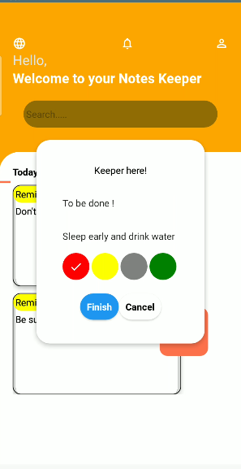
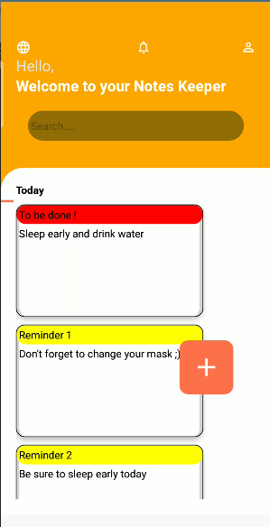

### About :grey_exclamation: : 
It's about a sample react native Reminder app 

### Setup :high_brightness: : 
To get started just type in the root directory the command : 
> ``` npm install ```

to install the necessary packages, then to launch the app on android : 
> ``` npm run android ```

### Screens : 
<div >
  <span style="display:inline-block;width:250px">
    
  </span>
  <span style="display:inline-block;width:250px">
    
  </span>
</div>